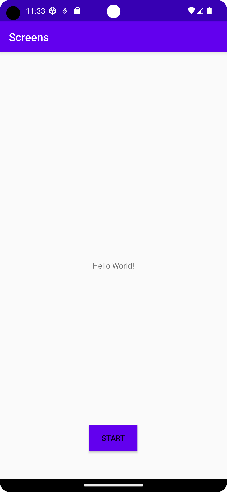

# Rapport

** Screens **
Först skapades en till aktivitet innehållande en knapp och ett textfält, därefter deklarerades varsin 
funktion till både knappen i huvudaktiviteten och i den ny aktiviteten. Knappfunktionen i 
huvudaktiviteten skickar en intent som gör att man kan starta den andra aktiviteten i intent skickas
även en extra sträng med ett värde till den andra aktiviteten, knappen i den andra stänger aktiviteten
och man kommer tillbaka till huvudaktiviteten (se Kodsegment 1). Den extra strängen som skickas 
ersätter strängen i "textView"-elementet som tillhör "secondActivity". 

# Kodsegment 1:
```
// MainActivity
public class MainActivity extends AppCompatActivity {

    @Override
    protected void onCreate(Bundle savedInstanceState) {
        super.onCreate(savedInstanceState);
        setContentView(R.layout.activity_main);
        Button button = findViewById(R.id.start_second_activity);
        button.setOnClickListener(new View.OnClickListener() {
            @Override
            public void onClick(View view) {
                Intent intent = new Intent(MainActivity.this, SecondActivity.class);
                intent.putExtra("name", "Hey Universe!");
                startActivity(intent);
            }
        });
    }
}
// SecondActivity
public class SecondActivity extends AppCompatActivity {

    @Override
    protected void onCreate(Bundle savedInstanceState) {
        super.onCreate(savedInstanceState);
        setContentView(R.layout.activity_second);
        TextView textView = findViewById(R.id.second_text);

        Bundle extras = getIntent().getExtras();
        if (extras != null) {
            String name = extras.getString("name");
            textView.setText(name);
        }
        Button close = findViewById(R.id.close_second_activity);
        close.setOnClickListener(new View.OnClickListener() {
            @Override
            public void onClick(View view) {
                finish();
            }
        });
    }
}
```

# Bilagor:

